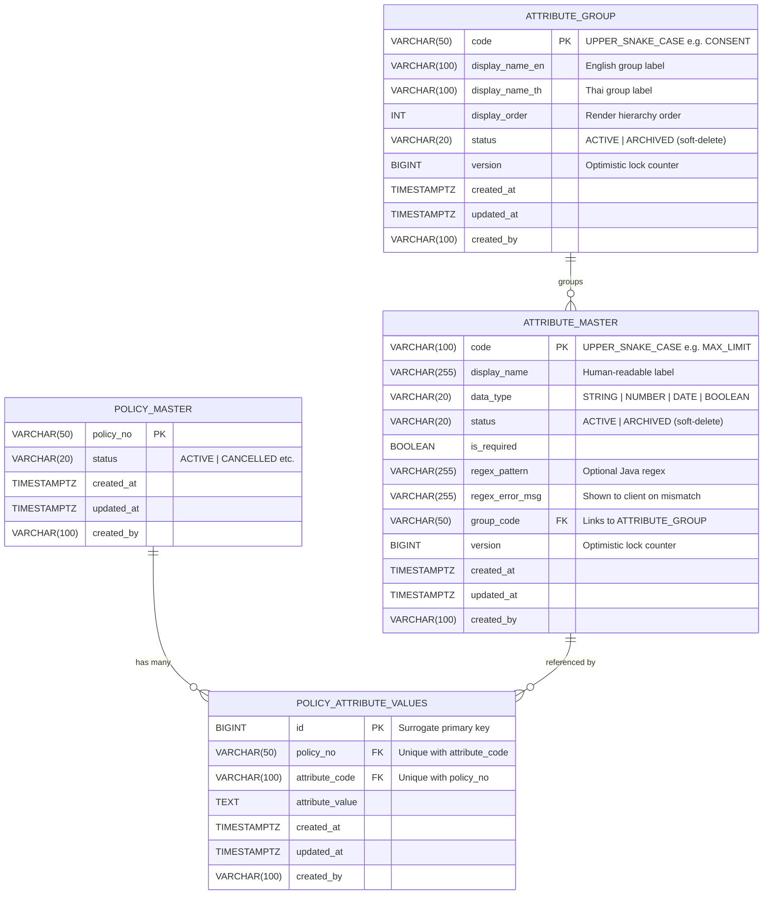
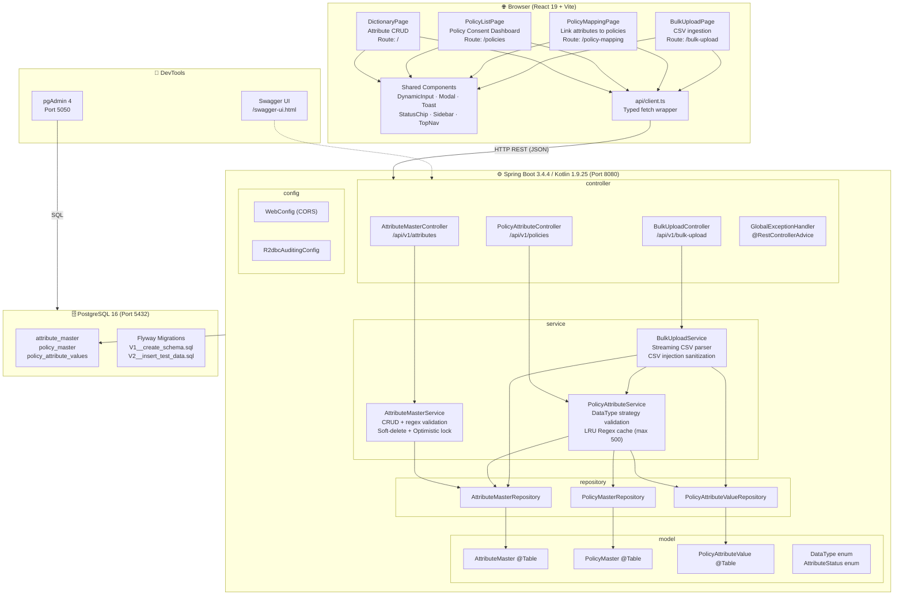

# Policy Attribute Management System (PAMS)

> A full-stack enterprise application for managing and mapping dynamic policy attributes.  
> **Backend:** Spring Boot 3.4.4 (Kotlin 1.9.25, WebFlux, R2DBC, Coroutines, Gradle) | **Frontend:** React 19 (TypeScript, Vite, Tailwind CSS) | **Database:** PostgreSQL 16

---

## Table of Contents

1. [Overview](#1-overview)
2. [Tech Stack](#2-tech-stack)
3. [Architecture](#3-architecture)
4. [ER Diagram](#4-er-diagram)
5. [Service Diagram](#5-service-diagram)
6. [Project Structure](#6-project-structure)
7. [API Reference](#7-api-reference)
8. [Implementation Details](#8-implementation-details)
9. [Running Locally](#9-running-locally)
10. [Database Migrations](#10-database-migrations)
11. [Design System](#11-design-system)

---

## 1. Overview

The **Policy Attribute Management System (PAMS)** is a high-density, enterprise-grade web application that provides:

- **Attribute Dictionary** — A central registry of all attribute definitions (data type, validation rules, regex patterns).
- **Policy Attribute Mapping** — Linking specific attribute values to individual policies.
- **Bulk Upload** — Streaming CSV ingestion with row-level validation and error reporting.
- **Dynamic Validation** — Each attribute value is validated at the API layer against its configured `data_type` and `regex_pattern`.

---

## 2. Tech Stack

| Layer          | Technology                                                      |
|----------------|-----------------------------------------------------------------|
| **Backend**    | Kotlin 1.9.25, Spring Boot 3.4.4, Gradle 8.x                   |
| **Reactive**   | Spring WebFlux, Kotlin Coroutines & Flow                        |
| **Plugins**    | `kotlin-jvm`, `kotlin-spring`                                   |
| **Persistence**| Spring Data R2DBC (Reactive Postgres) + Flyway Migrations       |
| **Database**   | PostgreSQL 16 (Alpine)                                          |
| **Frontend**   | React 19, TypeScript 6, Vite 6, Tailwind CSS 4                  |
| **Routing**    | React Router DOM 7                                              |
| **API Docs**   | SpringDoc OpenAPI / Swagger UI WebFlux (`/swagger-ui.html`)      |
| **DB Admin**   | pgAdmin 4 (port `5050`)                                         |
| **Container**  | Docker Compose (Postgres + pgAdmin)                             |
| **Target**     | OpenShift                                                       |

---

## 3. Architecture

The backend follows a **reactive, non-blocking 3-tier architecture** using Spring WebFlux and Kotlin Coroutines/Flow:

```
┌─────────────────────────────────────────────────────────────┐
│                    controller (REST Layer)                    │
│   AttributeMasterController  PolicyAttributeController       │
│   AttributeGroupController   BulkUploadController            │
│   GlobalExceptionHandler                                     │
└───────────────────────┬─────────────────────────────────────┘
                        │ calls (suspend / Flow)
┌───────────────────────▼─────────────────────────────────────┐
│                   service (Business Logic)                    │
│   AttributeMasterService   PolicyAttributeService            │
│   AttributeGroupService    BulkUploadService                 │
└───────────────────────┬─────────────────────────────────────┘
                        │ uses (CoroutineCrudRepository)
┌───────────────────────▼─────────────────────────────────────┐
│                  repository (Data Access)                     │
│   AttributeMasterRepository  PolicyMasterRepository          │
│   AttributeGroupRepository   PolicyAttributeValueRepository  │
└───────────────────────┬─────────────────────────────────────┘
                        │ persisted via (R2DBC)
┌───────────────────────▼─────────────────────────────────────┐
│                    model (Domain Entities)                    │
│   AttributeMaster    PolicyMaster    PolicyAttributeValue    │
│   AttributeGroup     AttributeStatus DataType                │
└─────────────────────────────────────────────────────────────┘
```

**Supporting packages:**
- `dto` — Kotlin `data class` request/response objects with JSR-380 (`@Valid`) annotations
- `exception` — Custom `RuntimeException` subclasses (`AttributeValidationException`, `ResourceNotFoundException`)
- `config` — `@Configuration` classes (`WebConfig` for CORS, `R2dbcAuditingConfig` for reactive auditing)

**Key Architectural Decisions:**

| Decision | Rationale |
|----------|-----------|
| Soft Delete (`status = ARCHIVED`) | Preserves historical attribute data; never physically removes rows |
| Optimistic Locking (`@Version`) | Prevents lost-update conflicts during concurrent edits; supported natively by Spring Data R2DBC |
| `attribute_code` as PK | Human-readable lookup key (e.g., `MAX_LIMIT`); preferred over UUID in APIs |
| Surrogate PK for mapping table | `id` (BIGSERIAL) as primary key with unique index `uq_policy_attribute_values` on `(policy_no, attribute_code)` to ensure single mapping per policy-attribute pair |
| Streaming CSV parsing | Temp file & `CSVReader` stream minimize memory usage under constrained OpenShift pods. Supported by non-blocking Spring WebFlux `FilePart`. |
| Memoized Regex Cache | Thread-safe `LinkedHashMap`-based LRU cache (max 500) to optimize CPU cycles and prevent pattern re-compilation |

---

## 4. ER Diagram



### Entity Descriptions

| Entity | Table | Description |
|--------|-------|-------------|
| `AttributeGroup` | `attribute_group` | Defines group categories for policy attributes. Used to dynamically group attributes and render tabs/dropdown filters. |
| `AttributeMaster` | `attribute_master` | Central dictionary of attribute definitions. Each row defines one reusable attribute type with validation rules, optionally linked to an `attribute_group`. |
| `PolicyMaster` | `policy_master` | Represents an insurance policy. Serves as the left-hand side of attribute mappings. |
| `PolicyAttributeValue` | `policy_attribute_values` | Junction / fact table. Stores the actual **value** of an attribute **for a specific policy**. PK is surrogate `id`, and a unique constraint handles `(policy_no, attribute_code)`. |

---

## 5. Service Diagram



### Data Flow: Attribute Value Update

```
Browser (React)
  └─> PUT /api/v1/policies/{policyNo}/attributes/{attrCode}
         └─> PolicyAttributeController.updateValue() [suspend]
               └─> PolicyAttributeService.updateAttributeValue() [suspend]
                     ├─> AttributeMasterRepository.findById(attrCode)  → load definition
                     ├─> validateDataType(master, value)               → STRING/NUMBER/DATE/BOOLEAN
                     ├─> validateValueAgainstRegex(master, value)      → memoized Pattern
                     └─> PolicyAttributeValueRepository.save(entity)   → upsert via R2DBC
```

### Data Flow: Bulk CSV Upload

```
Browser (React)
  └─> POST /api/v1/bulk-upload  (multipart/form-data)
         └─> BulkUploadController.upload(FilePart) [suspend]
               └─> BulkUploadService.processCsv(FilePart) [suspend]
                     ├─> Save FilePart to temp file reactively
                     ├─> CSVReader (streaming line-by-line on Dispatchers.IO)
                     ├─> For each row:
                     │     ├─> AttributeMasterRepository.findById(attributeCode)
                     │     ├─> PolicyAttributeService.validateDataType()
                     │     ├─> PolicyAttributeService.validateValueAgainstRegex()
                     │     └─> Accumulate valid entities OR RowError
                     ├─> PolicyAttributeValueRepository.saveAll(validEntities) [returns Flow]
                     │     └─> collect() Flow to execute inserts in batch
                     └─> Return BulkUploadResultDto { totalRows, successCount, errorCount, errors[] }
```

---

## 6. Project Structure

```
policy-attibute/
├── docker-compose.yml           # PostgreSQL + pgAdmin containers
├── agent.md                     # Project rules & conventions
├── DESIGN.md                    # UI design system documentation
├── security-kotlin-skill.md     # Kotlin/Spring security audit skill
│
├── backend/                     # Spring Boot / Kotlin application
│   ├── build.gradle             # Kotlin + Spring + JaCoCo plugins
│   ├── settings.gradle
│   └── src/
│       ├── main/
│       │   ├── kotlin/com/example/kk/policyattribute/
│       │   │   ├── PolicyAttributeApplication.kt       # Entry point
│       │   │   │
│       │   │   ├── controller/                         # REST layer
│       │   │   │   ├── AttributeMasterController.kt    # /api/v1/attributes
│       │   │   │   ├── PolicyAttributeController.kt    # /api/v1/policies
│       │   │   │   ├── BulkUploadController.kt         # /api/v1/bulk-upload
│       │   │   │   └── GlobalExceptionHandler.kt       # @RestControllerAdvice
│       │   │   │
│       │   │   ├── service/                            # Business logic layer
│       │   │   │   ├── AttributeMasterService.kt       # Attribute CRUD
│       │   │   │   ├── PolicyAttributeService.kt       # Mapping + LRU validation
│       │   │   │   └── BulkUploadService.kt            # CSV streaming + sanitization
│       │   │   │
│       │   │   ├── repository/                         # Data access layer
│       │   │   │   ├── AttributeMasterRepository.kt
│       │   │   │   ├── PolicyMasterRepository.kt
│       │   │   │   └── PolicyAttributeValueRepository.kt
│       │   │   │
│       │   │   ├── model/                              # JPA entities & enums
│       │   │   │   ├── AttributeMaster.kt
│       │   │   │   ├── AttributeStatus.kt              # ACTIVE | ARCHIVED
│       │   │   │   ├── DataType.kt                     # STRING | NUMBER | DATE | BOOLEAN
│       │   │   │   ├── PolicyMaster.kt
│       │   │   │   ├── PolicyAttributeValue.kt
│       │   │   │   └── PolicyAttributeValueId.kt       # Composite PK (@Embeddable)
│       │   │   │
│       │   │   ├── dto/                                # Request/Response data classes
│       │   │   │   ├── AttributeMasterDto.kt
│       │   │   │   ├── BulkUploadResultDto.kt
│       │   │   │   ├── CreatePolicyRequestDto.kt
│       │   │   │   ├── PolicyAttributeValueDto.kt
│       │   │   │   └── UpdateAttributeValueRequestDto.kt
│       │   │   │
│       │   │   ├── exception/                          # Custom exceptions
│       │   │   │   ├── AttributeValidationException.kt
│       │   │   │   └── ResourceNotFoundException.kt
│       │   │   │
│       │   │   └── config/                             # Configuration
│       │   │       ├── JpaAuditingConfig.kt            # @EnableJpaAuditing
│       │   │       └── WebConfig.kt                    # CORS configuration
│       │   │
│       │   └── resources/
│       │       ├── application.properties
│       │       └── db/migration/
│       │           ├── V1__create_schema.sql           # attribute_master + policy_attribute_values
│       │           ├── V2__insert_test_data.sql        # Seed data
│       │           ├── V3__create_policy_master.sql    # policy_master table
│       │           └── V4__add_consent_attributes.sql  # PDPA/RPQ/Marketing consent attrs
│       │
│       └── test/kotlin/com/example/kk/policyattribute/ # JUnit 5 + mockito-kotlin tests
│           ├── controller/
│           │   ├── AttributeMasterControllerTest.kt
│           │   ├── PolicyAttributeControllerTest.kt
│           │   ├── BulkUploadControllerTest.kt
│           │   └── GlobalExceptionHandlerTest.kt
│           └── service/
│               ├── AttributeMasterServiceTest.kt
│               ├── PolicyAttributeServiceTest.kt
│               └── BulkUploadServiceTest.kt
│
└── frontend/                    # React 19 + Vite application
    ├── index.html
    ├── package.json
    ├── vite.config.ts
    ├── tailwind.config.js
    └── src/
        ├── App.tsx                                     # Router + Layout entry
        ├── main.tsx
        ├── index.css                                   # Design system tokens
        │
        ├── types/
        │   └── index.ts                               # TypeScript interfaces & enums
        │
        ├── api/
        │   └── client.ts                              # Typed fetch() wrapper for all endpoints
        │
        ├── components/                                # Shared UI components
        │   ├── DynamicInput.tsx                       # Regex-validated input field
        │   ├── FileDropZone.tsx                       # Drag-and-drop upload zone
        │   ├── Layout.tsx                             # Page shell (Sidebar + TopNav)
        │   ├── Modal.tsx                              # Glassmorphism modal wrapper
        │   ├── PolicyDetailPanel.tsx                  # Right-side policy detail panel
        │   ├── Sidebar.tsx                            # Navigation sidebar
        │   ├── StatusChip.tsx                         # ACTIVE/ARCHIVED status badge
        │   ├── Toast.tsx                              # Success/error toast notification
        │   └── TopNav.tsx                             # Top navigation bar
        │
        └── pages/                                     # Route-level page components
            ├── DictionaryPage.tsx                     # /          — Attribute Dictionary (CRUD)
            ├── PolicyListPage.tsx                     # /policies  — Policy Consent Dashboard
            ├── PolicyMappingPage.tsx                  # /policy-mapping — Policy–Attribute mapping
            └── BulkUploadPage.tsx                     # /bulk-upload — Multi-step CSV upload wizard
```

---

## 7. API Reference

Base URL: `http://localhost:8080/api/v1`  
Interactive docs: `http://localhost:8080/swagger-ui.html`

### 7.1 Attribute Groups — `/api/v1/attribute-groups`

| Method | Path | Description |
|--------|------|-------------|
| `GET` | `/attribute-groups` | List all groups. Optional: `?includeArchived=true` to include archived groups |
| `GET` | `/attribute-groups/{code}` | Get a single group by its `UPPER_SNAKE_CASE` code |
| `POST` | `/attribute-groups` | Create a new attribute group definition |
| `PUT` | `/attribute-groups/{code}` | Update an existing attribute group definition |
| `DELETE` | `/attribute-groups/{code}` | Soft-delete (sets `status = ARCHIVED`) |

**AttributeGroupDto schema:**
```json
{
  "code":           "CONSENT",
  "displayNameEn":  "Consent",
  "displayNameTh":  "ความยินยอม (Consent)",
  "displayOrder":   1,
  "status":         "ACTIVE",
  "version":        0,
  "createdAt":      "2026-05-24T00:00:00Z",
  "updatedAt":      "2026-05-24T00:00:00Z",
  "createdBy":      "system"
}
```

### 7.2 Attribute Dictionary — `/api/v1/attributes`

| Method | Path | Description |
|--------|------|-------------|
| `GET` | `/attributes` | List all attributes. Optional: `?search=term&status=ACTIVE` |
| `GET` | `/attributes/{code}` | Get a single attribute by its `UPPER_SNAKE_CASE` code |
| `POST` | `/attributes` | Create a new attribute definition |
| `PUT` | `/attributes/{code}` | Update an existing attribute definition |
| `DELETE` | `/attributes/{code}` | Soft-delete (sets `status = ARCHIVED`) |

**AttributeMasterDto schema:**
```json
{
  "code":         "MAX_LIMIT",
  "displayName":  "Maximum Limit",
  "dataType":     "NUMBER",
  "status":       "ACTIVE",
  "isRequired":   true,
  "regexPattern": "^\\d+(\\.\\d{1,2})?$",
  "regexErrorMsg":"Must be a valid decimal number",
  "version":      1,
  "createdAt":    "2026-04-18T00:00:00Z",
  "updatedAt":    "2026-04-18T00:00:00Z",
  "createdBy":    "system"
}
```

---

### 7.3 Policy & Attribute Values — `/api/v1/policies`

| Method | Path | Description |
|--------|------|-------------|
| `GET` | `/policies` | List all policies |
| `POST` | `/policies/create` | Create a policy with optional initial attributes |
| `GET` | `/policies/{policyNo}/attributes` | Get all attribute values for a policy |
| `PUT` | `/policies/{policyNo}/attributes/{code}` | Update/create a single attribute value |
| `POST` | `/policies/{policyNo}/attributes` | Bulk-save multiple attribute values |

**PUT body:**
```json
{ "attributeValue": "150000.00" }
```

---

### 7.4 Bulk Upload — `/api/v1/bulk-upload`

| Method | Path | Description |
|--------|------|-------------|
| `POST` | `/bulk-upload` | Upload CSV file (`multipart/form-data`, field name: `file`) |

**CSV format:**
```
policy_no,attribute_code,attribute_value
POL-001,MAX_LIMIT,150000
POL-001,INCEPTION_DATE,2026-01-01
POL-002,IS_ACTIVE,true
```

**Response:**
```json
{
  "totalRows":    3,
  "successCount": 2,
  "errorCount":   1,
  "errors": [
    {
      "rowNumber":    3,
      "policyNo":     "POL-002",
      "attributeCode":"IS_ACTIVE",
      "errorMessage": "Expected true or false but got: yes"
    }
  ]
}
```

---

## 8. Implementation Details

### 8.1 Validation Pipeline (`PolicyAttributeService`)

Every attribute value passes through a **two-stage validation** before persistence, implemented using idiomatic Kotlin within a reactive suspending function context:

```
Stage 1 — Data Type Strategy (Kotlin when expression on DataType enum)
  STRING  → always valid at type level
  NUMBER  → value.toDoubleOrNull() ?: throw AttributeValidationException(...)
  DATE    → LocalDate.parse(value)   ISO-8601 (YYYY-MM-DD), catches DateTimeParseException
  BOOLEAN → value.equals("true", ignoreCase=true) || value.equals("false", ignoreCase=true)

Stage 2 — Regex Validation (LRU-bounded memoized cache, max 500 entries)
  regexCache.computeIfAbsent(pattern) { Pattern.compile(it) }
  compiled.matcher(value).matches()
  → throws AttributeValidationException(code, regexErrorMsg)
```

**Regex Cache Implementation:** Uses a `Collections.synchronizedMap` wrapping a `LinkedHashMap` in access-order mode (`accessOrder = true`) with `removeEldestEntry()` overriding at `size > 500`, providing a thread-safe LRU cache that prevents OOM from unbounded growth.

### 8.2 Soft Delete Strategy

Attributes are **never physically deleted**. Instead, `status` is set to `ARCHIVED`:
- Archived attributes cannot receive new values (`PolicyAttributeService` rejects them).
- The `listAttributes` endpoint accepts `?status=ACTIVE` to exclude archived entries.
- The **Select Attribute Modal** on the frontend filters out `ARCHIVED` attributes.

### 8.3 Optimistic Locking

`AttributeMaster` and `AttributeGroup` entities carry a `@Version var version: Long? = null` field. The database handles the increment; when a client sends a stale `version`, Spring Data R2DBC throws an `OptimisticLockingFailureException`, which `GlobalExceptionHandler` catches and returns as `HTTP 409 Conflict`.

### 8.4 Streaming CSV Upload (`BulkUploadService`)

```kotlin
// Save FilePart content to temp file reactively first:
file.transferTo(tempFile).awaitSingleOrNull()

// Stream read cells line-by-line within an IO dispatcher:
withContext(Dispatchers.IO) {
    CSVReader(InputStreamReader(Files.newInputStream(tempFile), StandardCharsets.UTF_8)).use { reader ->
        reader.readNext() ?: throw AttributeValidationException("CSV file is empty")
        var row: Array<String>?
        while (reader.readNext().also { row = it } != null) {
            // validate data-type + regex per row
            // accumulate valid entities or RowErrors
        }
    }
}
// Save entities into R2DBC which returns Flow, collect Flow to execute inserts:
valueRepository.saveAll(validEntities).collect()
```

Memory usage is bounded to one row at a time + the accumulated valid-entity list — safe for OpenShift pods with restricted heap.

**CSV Injection Sanitization:** Each cell is sanitized via `sanitizeCsvCell()`, which prepends a single quote (`'`) to any value starting with formula-trigger characters (`=`, `+`, `-`, `@`, `\r`, `\t`) — an OWASP-recommended mitigation against spreadsheet formula injection.

### 8.5 Frontend Architecture

| Component | Responsibility |
|-----------|----------------|
| `DynamicInput` | Accepts `regex` + `errorMessage` props; validates on `onBlur`; sets error state |
| `FileDropZone` | Drag-and-drop zone; calls `onFile(file)` callback |
| `PolicyDetailPanel` | Master-detail right panel; inline editing of attribute values |
| `Modal` | Glassmorphism overlay (`backdrop-filter: blur(20px)`) |
| `Toast` | Auto-dismissing success/error notification |
| `StatusChip` | Pill badge rendering `ACTIVE` (blue) / `ARCHIVED` (orange) |

### 8.6 R2DBC Auditing

`R2dbcAuditingConfig` enables `@EnableR2dbcAuditing` with a static `ReactiveAuditorAware<String>` returning a `Mono.just("system")`. All entity tables auto-populate `created_at`, `updated_at`, and `created_by` via Spring Data Relational annotations.

### 8.7 Policy Consent Dashboard (`PolicyListPage`)

The `PolicyListPage` (`/policies`) serves as a read-only executive view that:
- Fetches all policies via `GET /api/v1/policies`.
- In parallel (`Promise.allSettled`), fetches each policy's attributes via `GET /api/v1/policies/{policyNo}/attributes`.
- Resolves the `PDPA_CONSENT`, `RPQ_COMPLETED`, and `MARKETING_CONSENT` attribute values and displays them as soft-pill consent chips with semantic colour coding (green/red/amber/purple).
- Provides an action menu to navigate directly to the policy's attribute mapping (`/policy-mapping?search={policyNo}`) or copy the policy number.

---

## 9. Running Locally

### Prerequisites

- Java 21 JDK
- Node.js 20+
- Docker Desktop

### Step 1 — Start Infrastructure

```bash
# From project root
docker compose up -d
```

Starts:
- **PostgreSQL 16** on `localhost:5432` (`pams_db` / `pams_user` / `pams_secret`)
- **pgAdmin 4** on `http://localhost:5050` (`admin@pams.com` / `admin123`)

### Step 2 — Run Backend

```bash
cd backend
./gradlew bootRun
```

- API server: `http://localhost:8080`
- Swagger UI: `http://localhost:8080/swagger-ui.html`
- Flyway will automatically run all pending migrations on startup.

### Step 3 — Run Frontend

```bash
cd frontend
npm install
npm run dev
```

- Frontend: `http://localhost:5173`
- Proxies API calls to `http://localhost:8080`

---

## 10. Database Migrations

Managed by **Flyway** (`classpath:db/migration`):

| Version | File | Description |
|---------|------|-------------|
| V1 | `V1__create_schema.sql` | Creates the consolidated tables (`attribute_group`, `attribute_master`, `policy_master`, `policy_attribute_values`) with surrogate key constraints |
| V2 | `V2__insert_test_data.sql` | Seeds initial test data including attribute groups, master attributes, policies, and attribute value mappings |

> Flyway runs automatically on application startup. Configuration details are loaded from `application.properties`.

---

## 11. Design System

The UI follows the **"Institutional Architect"** design language (documented in `DESIGN.md`).

### Key Design Tokens

| Token | Value | Usage |
|-------|-------|-------|
| Primary | `#00008F` / `#000051` | Brand navy — CTAs, headings |
| Secondary | `#F26522` / `#a63b00` | Orange — high-stakes actions |
| Surface | `#f9f9ff` | Page background |
| Surface Card | `#ffffff` | Cards, inputs |
| On Surface | `#141c29` | Primary text |

### Core Rules

- **No 1px lines** for layout — use tonal background shifts instead.
- **Glassmorphism** for modals/dropdowns: `backdrop-filter: blur(20px)`.
- **Gradient CTAs**: `linear-gradient(135deg, #000051, #00008f)`.
- **Fonts**: Public Sans (headings) + Inter (data/forms).
- **Soft roundness**: `border-radius: 0.375rem` minimum everywhere.
- **Status chips**: Muted tones only (no traffic-light red/green/amber).

### Screen Inventory

| # | Screen | Route | Description |
|---|--------|-------|-------------|
| 1 | Attribute Dictionary | `/` | Master list — search, filter, CRUD |
| 2 | Attribute Configuration | `/` (modal) | Single attribute detail/edit form |
| 3 | Select Attribute Modal | `/` (modal) | Glassmorphism search-and-multi-select |
| 4 | Policy Consent Dashboard | `/policies` | Policy list with PDPA/RPQ/Marketing consent status chips |
| 5 | Policy Attribute Mapping | `/policy-mapping` | Master-detail: policy list + attribute table |
| 6 | Bulk Upload Manager | `/bulk-upload` | Multi-step CSV wizard with validation results |

---

## Environment Variables

| Variable | Default | Description |
|----------|---------|-------------|
| `POSTGRES_DB` | `pams_db` | Database name |
| `POSTGRES_USER` | `pams_user` | DB username |
| `POSTGRES_PASSWORD` | `pams_secret` | DB password |
| `PGADMIN_DEFAULT_EMAIL` | `admin@pams.com` | pgAdmin login email |
| `PGADMIN_DEFAULT_PASSWORD` | `admin123` | pgAdmin login password |
| `server.port` | `8080` | Spring Boot server port |

---

*Generated: 2026-05-17 | Project: Policy Attribute Management System (PAMS) | Backend: Kotlin 1.9.25 + Spring Boot 3.4.4*
